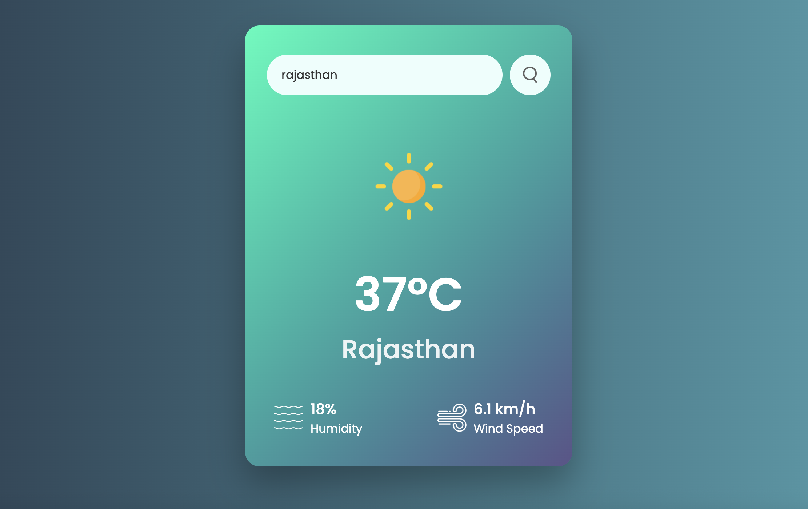

# 🌦️ Weatherly

**Weatherly** is a simple and elegant weather application that allows users to search for any city and view the current weather details in real time using the [OpenWeatherMap API](https://openweathermap.org/api).

<br/>

 <!-- Optional: Add screenshot here -->

---

## 🚀 Features

- 🔍 Search any city and get live weather updates
- 🌡️ Displays temperature, humidity, and wind speed
- ⛅ Shows dynamic weather icons
- 💅 Responsive and beautiful UI using pure HTML, CSS, and JavaScript
- ☁️ Powered by OpenWeatherMap API

---

## 🛠️ Technologies Used

- HTML5
- CSS3
- JavaScript (ES6)
- [OpenWeatherMap API](https://openweathermap.org/api)
- GitHub Pages for deployment

---

## 📦 Setup Instructions

1. Clone the repository:

   ```bash
   git clone https://github.com/your-username/Weatherly.git

   ```

2. cd Weatherly

3. const api_key = "your-api-key-here";

🌐 Live Demo
👉 Visit Weatherly on GitHub Pages

🙋‍♂️ Author
Made with ❤️ by Mithun Gupta
🧑‍💻 GitHub: @Mithunmkks
